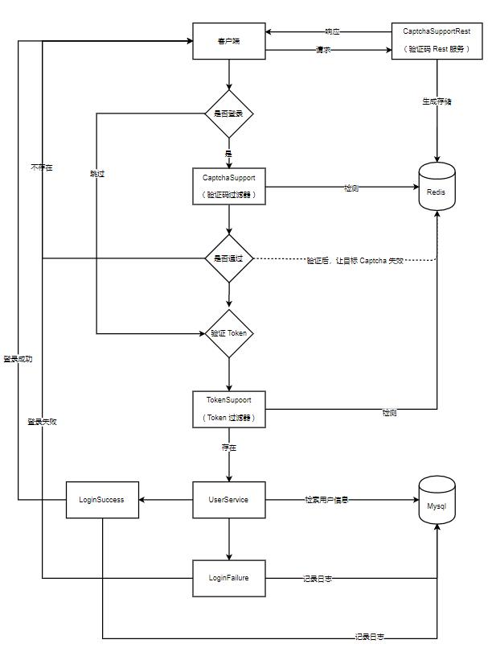

<div align="center">
<br/>
  
  <h1 align="center">
    Pear Admin Pro
  </h1>
  
  <h4 align="center">
     开 箱 即 用 的 Spring 企 业 级 开 发 平 台
  </h4> 
  
  [预 览](http://ant.pearadmin.com)   |   [官 网](http://www.pearadmin.com/)   |   [群聊](https://jq.qq.com/?_wv=1027&k=5OdSmve)   |   [社区](http://forum.pearadmin.com/)

</div>

<p align="center">
    <a href="#">
        
    </a>
    <a href="#">
        
    </a>
      <a href="#">
        
    </a>
</p>

<div align="center">
  
</div>

### 项目介绍  :jack_o_lantern: 

Spring Boot + Security + MyBatis Plus + Vue + Ant Design Vue 快速开发平台

### 功能概览

- [x] 用户管理: 用户是系统操作者，该功能主要完成系统用户配置。
- [ ] 角色管理: 角色菜单权限分配、设置角色按机构进行数据范围权限划分。
- [ ] 权限管理: 配置系统菜单，操作权限，按钮权限标识等。
- [ ] 数据字典: 对系统中经常使用的一些较为固定的数据进行维护。
- [ ] 资源管理
- [ ] 配置中心: 对系统动态配置常用参数。
- [x] 运行环境: 监视当前系统CPU、内存、磁盘、堆栈等相关信息。
- [x] 在线用户
- [ ] 通知公告：系统通知公告信息发布维护。
- [ ] 定时任务: 在线（添加、修改、删除)任务调度包含执行结果日志。
- [x] 登录日志: 系统登录日志记录查询包含登录异常。
- [x] 操作日志: 系统正常操作日志记录和查询；系统异常信息日志记录和查询。

#### 项目结构

```
Pear Admin Pro
│
├─annex  Sql 资源
│
├─src 公共模块
│  │
│  └─main 
│     │
│     ├─java  源码文件
│     │  
│     │   
│     └─resource 资源文件
│  
└─pom.xml  Maven 配置

```


### 业务流程


#### 登录认证

Spring Security 提供实现，扩展 Token Captcha 相关过滤器


<div align="center">
  
</div>

#### 系统配置

BaseCache 提供缓存策略，AllocationCache 为 SysConfig 缓存实现


<div align="center">
  
</div>

#### 数据字典


BaseCache 提供缓存策略，DictionaryCache 为 SysDict 缓存实现

<div align="center">
  
</div>


### 界面预览

| 界面              |                预览  |  
|---------------------|---------------------|
|   |   |
| |     |
| |     |
| |     |
