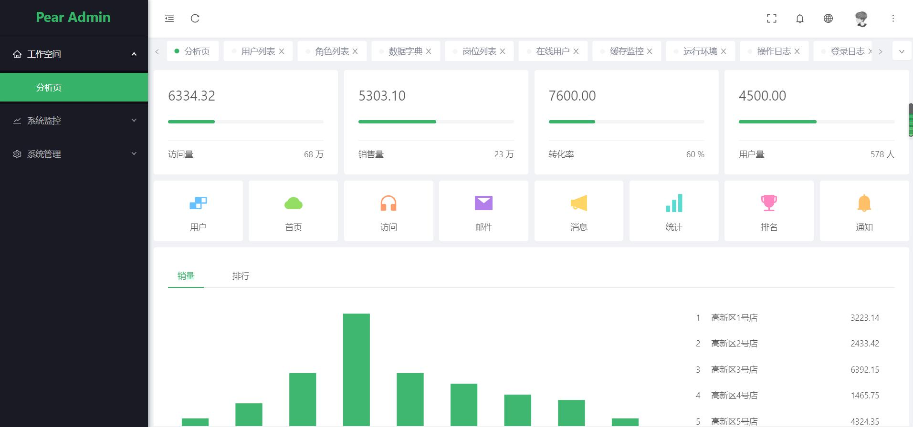
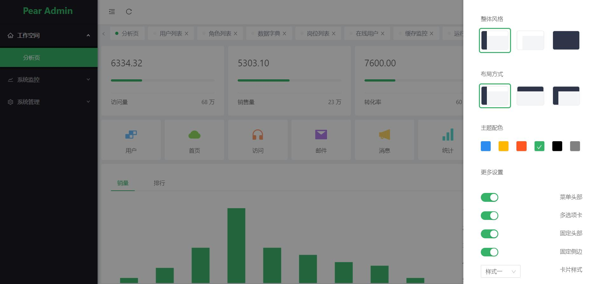
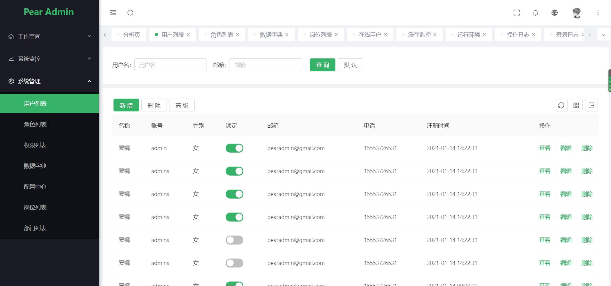
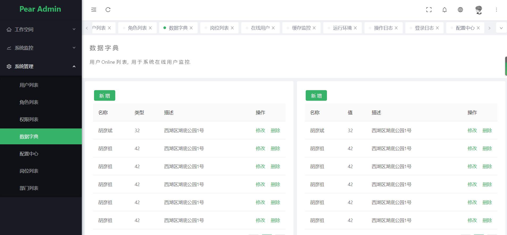
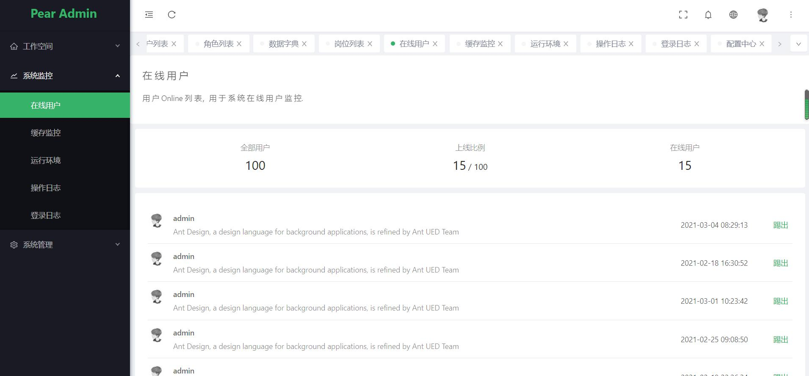
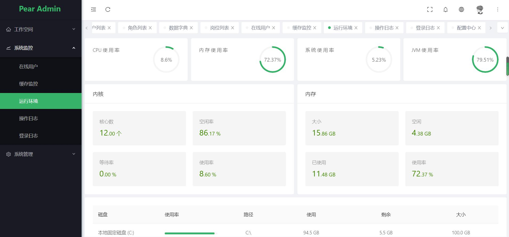
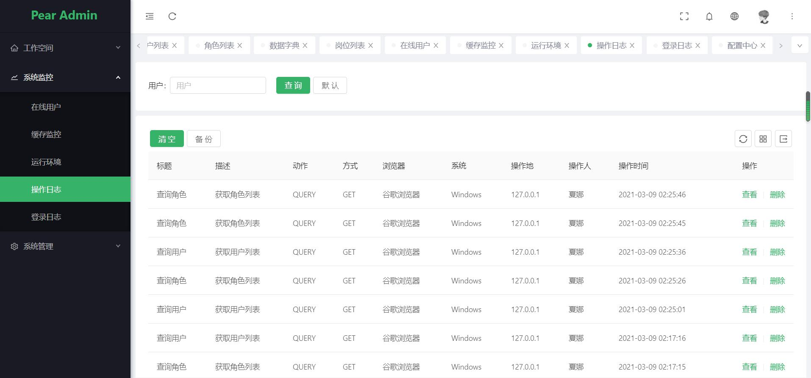
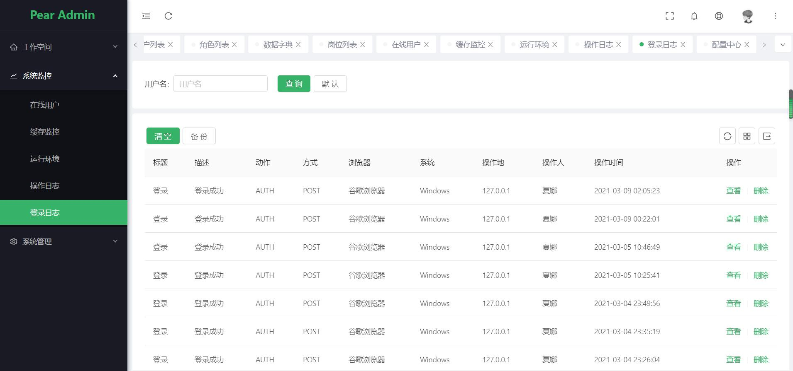

<div align="center">
<br/>
  
  <h1 align="center">
    Pear Admin Pro
  </h1>
  
  <h4 align="center">
     开 箱 即 用 的 Spring Boot 企 业 级 开 发 平 台
  </h4> 
  
  [预 览](http://ant.pearadmin.com)   |   [官 网](http://www.pearadmin.com/)   |   [群聊](https://jq.qq.com/?_wv=1027&k=5OdSmve)   |   [社区](http://forum.pearadmin.com/)

</div>

<p align="center">
    <a href="#">
        
    </a>
    <a href="#">
        
    </a>
    <a href="#">
        
    </a>
    <a href="#">
        
    </a>
</p>

<div align="center">
  
</div>

### 🌈 项目概述

* 基于 Spring 实现的通用权限管理平台（RBAC模式）。整合最新技术高效快速开发，前后端分离模式，开箱即用。
* 核心模块包括：用户、角色、职位、组织机构、菜单、字典、日志、多应用管理、文件管理、定时任务等功能。
* 代码量少、学习简单、功能强大、轻量级、易扩展，轻松开发从现在开始！

### ☘ 更新日志

更新日志 [查看日志](https://gitee.com/pear-admin/pear-admin-pro/releases)

### 🍚 功能概览

- [x] 用户管理:  用户是系统操作者，该功能主要完成系统用户配置。
- [ ] 角色管理:  角色菜单权限分配、设置角色按机构进行数据范围权限划分。
- [ ] 权限管理:  配置系统菜单，操作权限，按钮权限标识等。
- [x] 岗位管理： 配置系统用户所属担任职务。
- [ ] 部门管理： 配置系统组织机构（公司、部门、小组），树结构展现支持数据权限。
- [ ] 数据字典:  对系统中经常使用的一些较为固定的数据进行维护。
- [x] 配置中心:  对系统动态配置常用参数。
- [x] 运行环境:  监视当前系统CPU、内存、磁盘、堆栈等相关信息。
- [ ] 缓存监控： 对系统的缓存查询，删除、清空等操作。
- [x] 在线用户:  用户在线列表，用于系统在线用户监控。
- [ ] 通知公告:  系统通知公告信息发布维护。
- [ ] 定时任务:  在线（添加、修改、删除)任务调度包含执行结果日志。
- [ ] 表单设计： 拖动表单元素生成相应的HTML代码。
- [x] 登录日志:  系统登录日志记录查询包含登录异常。
- [x] 操作日志:  系统正常操作日志记录和查询；系统异常信息日志记录和查询。
- [x] 邮件发送:  发送邮件功能。
- [x] 多数据源:  系统正常操作日志记录和查询；系统异常信息日志记录和查询。
- [x] 主题切换:  系统正常操作日志记录和查询；系统异常信息日志记录和查询。


### 🔨 项目结构

```
Pear Admin Pro
│
├─annex SQL 脚本
│
├─src 公共模块
│  │
│  └─main 
│      │
│      ├─java 源码文件
│      │   │
│      │   ├─common 公共代码
│      │   │   │
│      │   │   ├─aop 切面逻辑
│      │   │   │
│      │   │   ├─config 集成配置
│      │   │   │
│      │   │   ├─constant 静态常量
│      │   │   │
│      │   │   ├─interceptor 拦截器
│      │   │   │
│      │   │   ├─secure 安全
│      │   │   │
│      │   │   ├─tools 工具包
│      │   │   │
│      │   │   └─web 核心封装
│      │   │   
│      │   ├─modules 业务代码
│      │   │   │
│      │   │   ├─job 定时任务
│      │   │   │
│      │   │   └─sys 基础功能
│      │   │   
│      │   └─EntranceApplication 启动类
│      │   
│      └─resource 资源文件
│  
└─pom.xml  Maven 配置

```
### 📖 帮助文档


### 🍻 贡献代码

<p style="padding:10px;"  width="90%">

1. 欢迎提交 [pull request](https://gitee.com/pear-admin/pear-admin-pro/pulls)，注意对应提交对应 `develop` 分支

2. 欢迎提交 [issue](https://gitee.com/pear-admin/pear-admin-pro/issues)，请写清楚遇到问题的原因、开发环境、复显步骤。

</p>

### 🍎 预览界面

| 预览              |                界面  |  
|---------------------|---------------------|
|   |   |
| |     |
| |     |
| |     |
| |     |

### 🎯 近期计划

- [ ] 对象存储:  系统正常操作日志记录和查询；系统异常信息日志记录和查询。
- [ ] 短信发送:  短信发送功能，可使用阿里云sms，腾讯云sms，支持拓展。
- [ ] 租户模式:  系统正常操作日志记录和查询；系统异常信息日志记录和查询。

### 💐 特别鸣谢

- 👉 Vue：[https://gitee.com/baomidou/mybatis-plus](https://gitee.com/baomidou/mybatis-plus)
- 👉 Ant Design Vue：[https://gitee.com/ant-design-vue/ant-design-vue](https://gitee.com/ant-design-vue/ant-design-vue)
- 👉 Spring Boot：[https://gitee.com/baomidou/mybatis-plus](https://gitee.com/baomidou/mybatis-plus)
- 👉 MyBatis Plus：[https://gitee.com/baomidou/mybatis-plus](https://gitee.com/baomidou/mybatis-plus)

